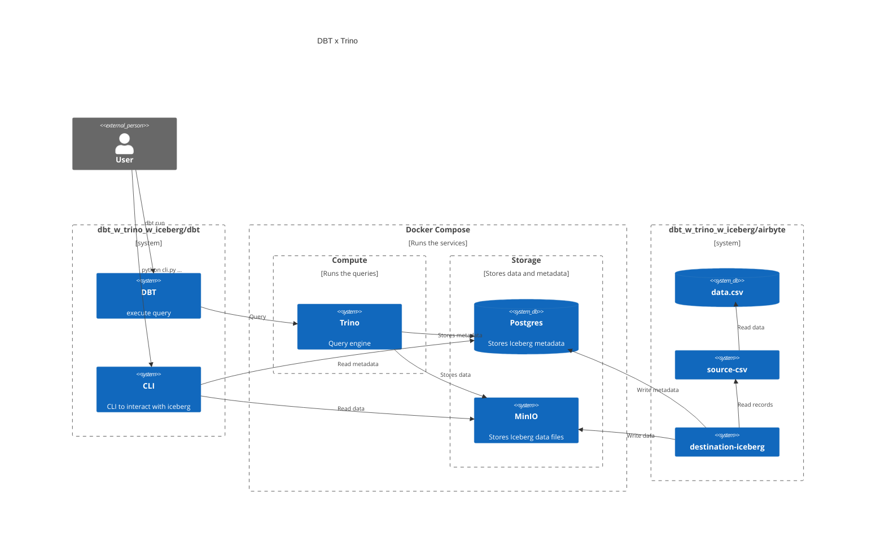

# Getting started

## Preriquisites
- Python 3.12
- docker-compose


## Start trino server
Run the following command to start the trino server
```bash
cd dbt_w_trino_w_iceberg/
env UID=${UID} GID=${GID} docker compose up
```

## Setup dbt
Run the following command to setup the dbt environment
```bash
cd dbt_w_trino_w_iceberg/dbt
python3.12 -m venv --prompt dbt-trino .venv
source dbt/.venv/bin/activate
pip install poetry
poetry install
```

## Run dbt
Run the following command to run dbt
```bash
cd dbt_w_trino_w_iceberg/dbt
dbt run
```

## Check results with cli.py
```bash
cd dbt_w_trino_w_iceberg/dbt
python cli.py list
python cli.py list dbt
python cli.py scan dbt.incremental_model
```

## Run airbyte integration
```bash
cd dbt_w_trino_w_iceberg/airbyte
sh ingest.sh
````

## Check airbyte ingestion worked and is available in trino
```bash
cd dbt_w_trino_w_iceberg/dbt
dbt show --inline 'select * from {{ source("airbyte", "airbyte_raw_data") }}'
```

# System overview
