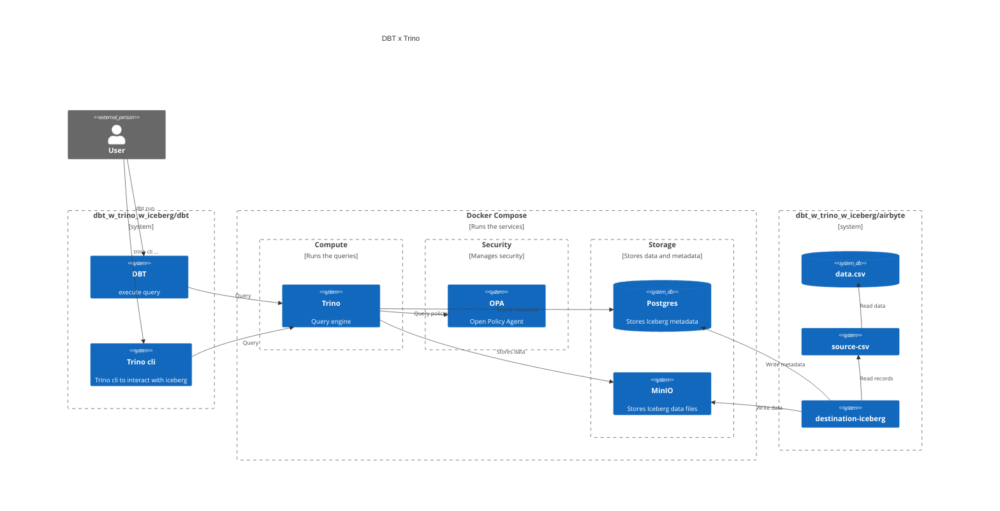

# *⚠ OUTDATED README ⚠* -- new version coming soon (or late)

# Getting started

## Preriquisites
- [uv](https://docs.astral.sh/uv/)
- [docker-compose](https://rancherdesktop.io/)

## Setup the mount point for docker-compose
Create a directory to mount the docker-compose volumes
```bash
cd dbt_w_trino_w_iceberg/
mkdir minio_volume postgres_volume
```

## Start trino server
Run the following command to start the trino server
```bash
cd dbt_w_trino_w_iceberg/
env UID=${UID} GID=${GID} docker compose up
```

## Setup dbt
Run the following command to setup the dbt environment
```bash
cd dbt_w_trino_w_iceberg/dbt
uv run dbt deps
```

## Run dbt
Run the following command to run dbt
```bash
cd dbt_w_trino_w_iceberg/dbt
uv run dbt build
```

## Check results
```bash
docker run -it --rm --network host trinodb/trino:463 trino --catalog mydata http://localhost:8080
```

```sql
trino> select * from dbt.any_to_any_v1_0;
 from_currency | to_currency |        rate        
---------------+-------------+--------------------
 EUR           | EUR         |                1.0 
 GBP           | EUR         | 1.4285714285714286 
 USD           | EUR         | 0.7692307692307692 
 EUR           | GBP         |                0.7 
 GBP           | GBP         |                1.0 
 USD           | GBP         | 0.5384615384615384 
 EUR           | USD         |                1.3 
 GBP           | USD         | 1.8571428571428574 
 USD           | USD         |                1.0 
(9 rows)
```

## Run airbyte integration
```bash
cd dbt_w_trino_w_iceberg/airbyte
sh ingest.sh
````

## Check airbyte ingestion worked and is available in trino
```bash
cd dbt_w_trino_w_iceberg/dbt
dbt show --inline 'select * from {{ source("airbyte", "airbyte_raw_data") }}'
```

# System overview

